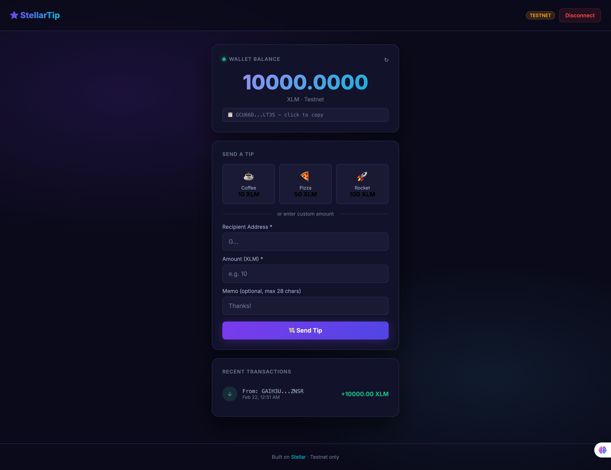

# ⭐ StellarTip — XLM Tip Jar dApp

Send XLM tips on Stellar Testnet. White Belt Stellar challenge submission.

## Features
- Connect/disconnect Freighter wallet
- Live XLM balance with refresh
- Preset tip amounts (☕10 / 🍕50 / 🚀100 XLM) + custom amount
- Transaction feedback with hash + Stellar Expert link
- Recent transaction history

## Quick Start
1. Install [Freighter Wallet](https://freighter.app)
2. Switch Freighter network to **Testnet**
3. Fund your account at [Stellar Lab Faucet](https://laboratory.stellar.org/#account-creator?network=test)
```bash
git clone https://github.com/uncletom29/stellartip
cd stellartip
npm install
npm run dev
```

Open http://localhost:5173

## Deploy
```bash
npx vercel --prod
```

## Screenshots
> Add: wallet connected, balance shown, successful transaction, tx result




## Stack
React 18 · Vite · @stellar/stellar-sdk · @stellar/freighter-api
